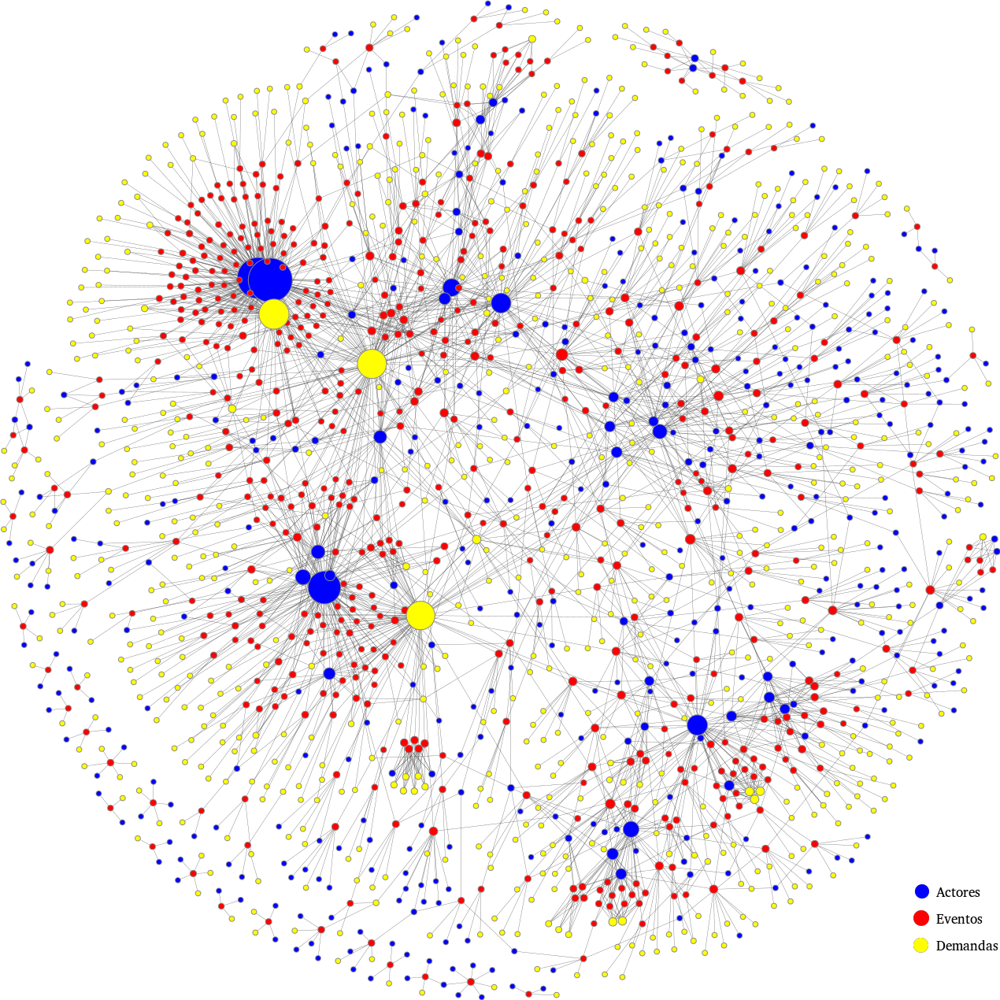

# Tesis
## Análisis de redes aplicado a coaliciones de eventos de protesta reportadas por el diario La Jornada
### (octubre 2012 a diciembre 2016)

Para obtener el título de _Licenciado en Matemáticas Aplicadas y Computación_.

### Introducción

Esta tesis se centra en la representación de la protesta colaborativa a partir de notas periodísticas que documentan la coparticipación en dichos eventos entre dos o más agrupaciones. Considerando a _eventos de protesta_, _actores colectivos_ participantes y sus _demandas_ como unidades sociales interrelacionadas, se analizan estructuras de red multipartitas, proyectadas y agregadas por categorizaciones sectoriales y temáticas. Tal esfuerzo pretende dar continuidad al trabajo emprendido por el  Laboratorio de Análisis de Organizaciones y Movimientos Sociales (LAOMS), quien recupera datos —a partir
de los cuales se basa este trabajo— sobre protestas, desde noticias publicadas en el diario La Jornada, suscribiendo su investigación a la _sociología de la acción colectiva_.

## Contenido del repositorio
Se incluyen tres directorios. 
- **/01_Datos** recabados y procesados que se mencionan en la tesis, en formato csv.
- **/02_Codigo** en R bajo el cual se crean gráficos y medidas reportadas. 
- **03_documento** los archivos empleados para crear el documento final a través de XeLaTex. 

## Documento final
* [Descargar (PDF)](03_documento/tesis.pdf)

## Licencia
GNU General Public License v3.0

